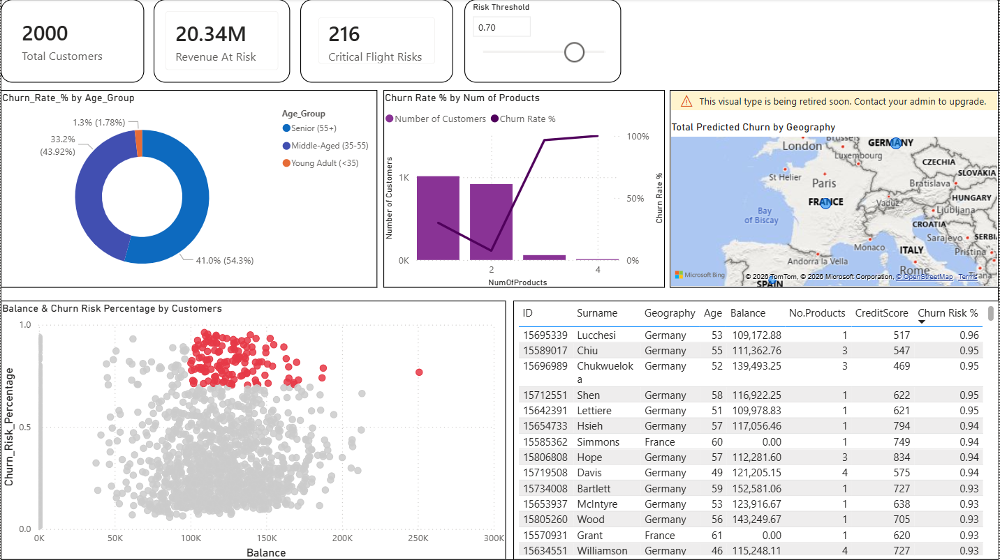

# Bank-Customer-Churn-Prediction

## Executive Summary & Business Value

Customer acquisition is roughly 5 to 25 times more expensive than customer retention. In retail banking, losing a high-net-worth individual doesn't just impact current account fees; it drains the bank's lending capital and destroys lifetime value (LTV).

This project bridges the gap between predictive analytics and proactive customer success. By deploying a highly tuned Random Forest classifier, this project shifts the retention strategy from a **reactive** approach (trying to save a customer after they initiate an account closure) to a **proactive** one (intervening before the customer makes the decision to leave).

### Model ROI & Financial Impact
Instead of applying blanket retention discounts to the entire customer base which wastes budget on loyal customers, this model enables targeted interventions. 

* **High-Precision Targeting:** By adjusting the model's decision threshold to optimize for a balanced F1-Score, the retention team can confidently allocate expensive perks (e.g., fee waivers, dedicated account managers) strictly to the high-risk segment identified by the algorithm, rather than wasting budget on the ~80% of the customer base that the historical data proves is naturally loyal.
* **Capital Preservation:** Integrating the model's risk probabilities with Power BI allows stakeholders to instantly quantify **"Total Revenue at Risk."** This empowers leadership to prioritize outreach not just by churn probability, but by the highest account balances, actively protecting the bank's liquidity.
* **Strategic Resource Allocation:** Extracting the Random Forest's feature importance metrics revealed that account activity and geographical location are critical drivers of churn. By isolating inactive customers in specific European markets (e.g., Germany) as a top-risk segment, the marketing department can deploy highly specific, localized re-engagement campaigns rather than generic, bank-wide blasts.

### The Final Deliverable
This repository contains the end-to-end pipeline: from raw data ingestion and feature engineering to model hyperparameter tuning. The final output is an exported dataset containing precise churn probability scores, designed specifically to feed directly into a BI tool for daily executive monitoring.

## Methodology

1. **Exploratory Data Analysis:** Investigated the 79/21 class imbalance and visualized the relationship between demographics (Geography, Gender) and financial behavior (Balance, Active Status) with churn.
2. **Feature Engineering:** Created new logical variables, such as `Balance_per_Age` ratios and a `High_Risk_Profile` flag for inactive customers in high-churn regions.
3. **Data Preprocessing:** Utilized `scikit-learn`'s `ColumnTransformer` to apply `StandardScaler` to numerical features and `OneHotEncoder` to categorical features strictly after the train-test split to prevent data leakage.
4. **Model Selection:** Trained and tuned multiple classification algorithms:
   - Logistic Regression
   - Support Vector Machine (SVM)
   - Random Forest Classifier (Winner)
   - XGBoost
5. **Evaluation:** Evaluated models using F1-Score, Precision, Recall, and AUC-ROC to handle the imbalanced nature of the dataset.

## Key Insights & Actionable Recommendations
*Interpretability is just as important as accuracy. Using EDA and Feature Importances, the model revealed:*

1. **The "Wealth" Flight Risk:** Customers with unusually high account balances are churning at a higher rate than low-balance customers. *Recommendation: Implement targeted premium perk programs or highly competitive interest rate matching for the top 10% of balance holders.*
2. **The Geography Factor:** Customers located in Germany are significantly more likely to exit compared to those in France or Spain. *Recommendation: Investigate regional competitor offerings or localized customer service issues in the German market.*
3. **The "Middle-Age Squeeze" (SHAP Interaction Analysis):** While basic models assume churn risk moves in a straight line, SHAP Dependence Plots revealed a complex, non-linear reality. Churn risk peaks drastically for middle-aged demographics before dropping off entirely for senior citizens. Crucially, this high-risk spike is heavily concentrated among customers with a **low Credit Score-to-Age ratio**. 
   * *Business Reality:* Middle age is a capital-intensive life stage (mortgages, tuition,...). A customer with a lower-than-average credit score for their age is likely facing loan rejections or punishing interest rates at our bank. Frustrated by a lack of access to capital, they churn to competitors with more lenient lending criteria.
4. **Activity Status:** Inactive members are a strong leading indicator of churn. *Recommendation: Deploy automated re-engagement campaigns before an account officially closes.*

*Beyond feature importance, I implemented **DiCE (Diverse Counterfactual Explanations)** to generate individualized retention strategies:*

5. **Actionable Recourse (Beyond "Why" to "How"):** While feature importance tells us why a cohort churns, Counterfactual Explanations calculate the exact minimum changes required to save an *individual*. By locking immutable traits (like Age and Geography), the algorithm identifies the shortest mathematical path to retention team. For exmaple, for a high-risk customer, the model may suggest that increasing their 'Number of Products' from 1 to 2 provides the shortest mathematical path to retention. This allows the bank's outreach team to move from generic "please stay" messages to highly specific, mathematically backed product offers.
*Recommendation: Equip the customer success team with these personalized "retention playbooks." Instead of generic outreach, representatives can make mathematically backed offers (e.g., offering a specific customer one additional product or an incentive to log into the mobile app) guaranteed to shift their behavior.*

6. **Rigorous XAI Validation ("Verifying Steps"):** Explainable AI tools use heuristic estimation, which can sometimes misalign with the highly complex, jagged decision boundaries of an optimized Random Forest model. To guarantee the integrity of these strategies, I implemented a programmatic cross-check validation step. The synthetic "Alternative Universe" profiles generated by DiCE are fed back through the live scikit-learn pipeline to explicitly verify the new probabilities. 
*Recommendation: Enforce this automated validation step in production to ensure the business never wastes retention budget on "false hope" strategies, guaranteeing that every recommended action actually drops the churn probability below the critical threshold.*

## Interactive Power BI Dashboard: From Predictions to Business Action

While machine learning models are built in Python, business decisions are driven by interactive BI tools. To bridge the gap between predictive analytics and operational strategy, the final predictions and risk probabilities were exported from the Random Forest model and visualized in **Power BI**. 

**The Purpose:** To transform abstract machine learning probabilities (e.g., "0.82 risk") into quantifiable financial metrics (e.g., "$125,000 at risk") and empower the retention team to operationalize the model without needing to read code.

### Dashboard Highlights & Functionality:
* **Dynamic 'Revenue at Risk' (What-If Parameter):** Built a custom DAX numeric range parameter that allows stakeholders to dynamically adjust the model's risk threshold (e.g., sliding from a 50% risk cutoff to an 80% risk cutoff). The dashboard instantly recalculates the total capital at risk, enabling leaders to balance their retention budget against the most critical flight risks.
* **The Scatter Plot:** Engineered custom DAX conditional formatting to visually isolate high-net-worth individuals who also exhibit a high probability of churning. High-balance, high-risk targets automatically highlight in red, giving the VIP banking team an immediate priority matrix.
* **Operational 'Hit List':** A dynamically sorted matrix table that maps the ML predictions back to the original `CustomerID`. This provides customer success managers with a daily, pre-ranked list of exactly who to call, complete with demographic context like geography and active status.

*(Below is a screenshot of the interactive dashboard in action)*

## Technologies Used
* **Python** (Pandas, NumPy)
* **Machine Learning:** Scikit-Learn, XGBoost
* **Visualization:** Matplotlib, Seaborn, PowerBI
